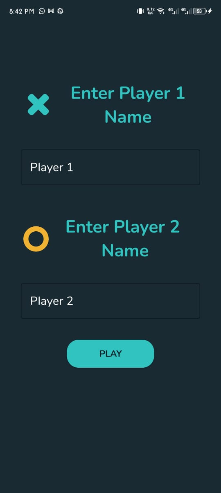
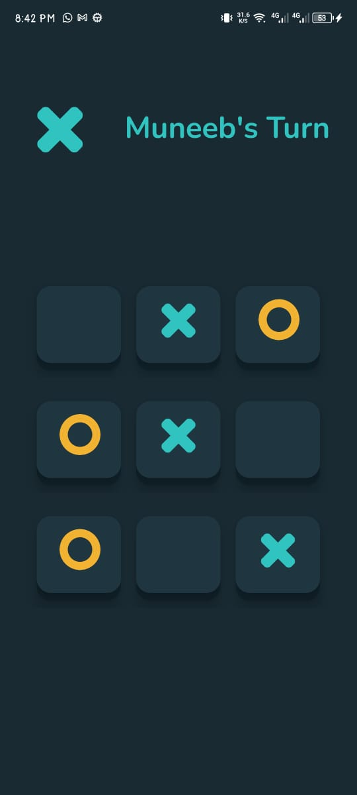
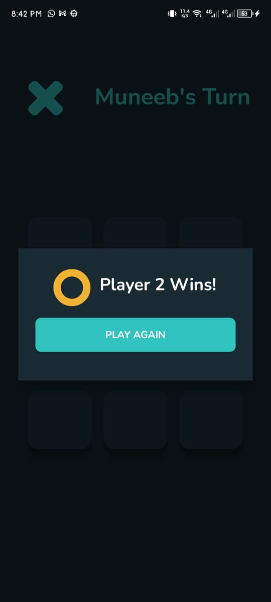
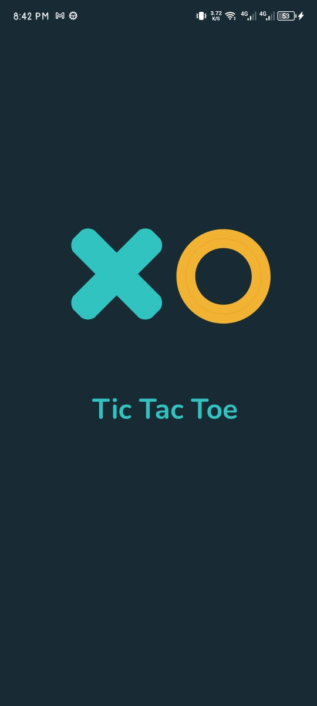

# Tic Tac Toe Android App

This is a simple Tic Tac Toe game Android app developed using Kotlin.

## Description

The app allows two players to play Tic Tac Toe on a 3x3 grid. Players take turns marking spaces with their respective symbols (X and O) until one player wins by getting three of their symbols in a row, column, or diagonal, or until the grid is full and the game ends in a draw.

## Screenshots

*Screenshot 1: User names input screen of the app*

*Screenshot 2: Game in progress*

*Screenshot 3: Game over dialog*

*Screenshot 4: Splash Screen Animated*

## Features

- Supports two players (X and O)
- Vibrates device on player turn change and game end
- Displays winner or draw message in a dialog
- Allows players to play again after game over

## Usage

-Enter the names of Player 1 and Player 2.
-Tap on the cells of the grid to make a move.
-The game will display a dialog when a player wins or when the game ends in a draw.
-Tap "Play Again" in the dialog to reset the game and play again.

## Contributing

-Contributions are welcome! Please create a pull request with any improvements or fixes.

## Licence

-This project is licensed under the MIT License.

## Developer

-Muneeb Khan
